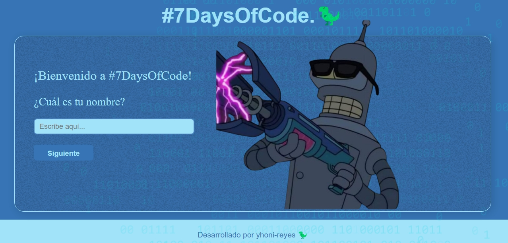

# #Day1,2-Variables
¡Hola, bienvenido a mi proyecto de variables!

## 🖼️ Vista Previa

 
## 🚀 Herramientas utilizadas:

* HTML

* CSS

* JavaScript

## 📌 Funcionalidades
✅ Es una modesta pagina de formulario
✅ Con tema de bender el tremendo de Futurama
✅ En el cual deberas reponder una sencillas preguntas
✅ Al final recibiras un mensaje inesperado

## 🎲 Cómo usarlo
1. Ingresa en este enlace: https://day1-2-variables.vercel.app/
2. Responde las preguntas
3. Solo da clic para avanzar
4. Listo! que tengas un buen dia! 

## Hecho por:

### yhoni-reyes 

### Linkedin: https://www.linkedin.com/in/jonathan-israel-reyes-m%C3%A9ndez-257b58318/
